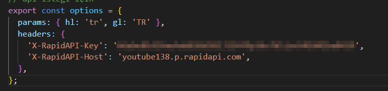

<!-- PROJECT LOGO -->
<br />
<div align="center" id="readme-top">
  <a href="https://github.com/sameteyuboglu/react-youtube-clone">
    
  </a>

<h3 align="center">REACT Youtube Clone </h3>

  <p align="center">
    createContext , 
    useContext , 
    useState , 
    useSearchParams ,
    useEffect ,
    useParams ,
    react router dom , 
    axios, 
    rapid api, 
    tailwind , 
    react icons ,     
    millify , 
    moment 
  </p>
</div>

## Başlangıç

React ile birlikte  createContext , useContext , Routing , useState , axios kullanımı için gerekli kurulumlar

### Kurulumlar

```sh
npm create vite@latest
```

```sh
npm i react-router-dom
```

```sh
npm install axios
```

```sh
npm i react-moment
```

```sh
npm i react-icons
```

```sh
npm i millify
```

```sh
npm i react-player
```

## Kullanımlar

Projemizi

```
npm create vite@latest react-youtube-clone --template react
```

```sh
cd react-youtube-clone
code .
```

ile oluşturuyoruz sonrasında projemizinde kullanacağımız axios'un kurulumunu yapıyoruz

```sh
npm install axios
```

routing elemanlarını kullanmak için react-router-dom

```sh
npm i react-router-dom
```

youtube player için

```sh
npm i react-player
```

zaman ile ilgili işlemler için kullanacağımız kütüphane
```sh
npm i react-moment
```

react icon kurulumu

```sh
npm i react-icons
```

görüntüleme numaralarının daha şık gözükmesi için örneğin 12345 in 12.3K gibi

```sh
npm i millify
```

projemizde kullanacağımız rapid api için https://rapidapi.com/Glavier/api/youtube138 adresinden token almamız gerekiyor sonrasında constant klasörü içerisindeki index.jsx içeriğindeki aşağıdaki bölüme aldığınız key i yapıştırmanız gereklidir.



sonra projemizi ayağa kaldırıyoruz

```sh
npm run dev
```


<p align="right">(<a href="#readme-top">Başa Dön</a>)</p>


## Son Durum

